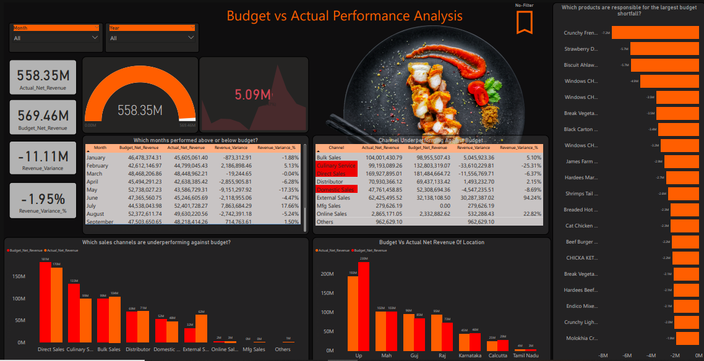
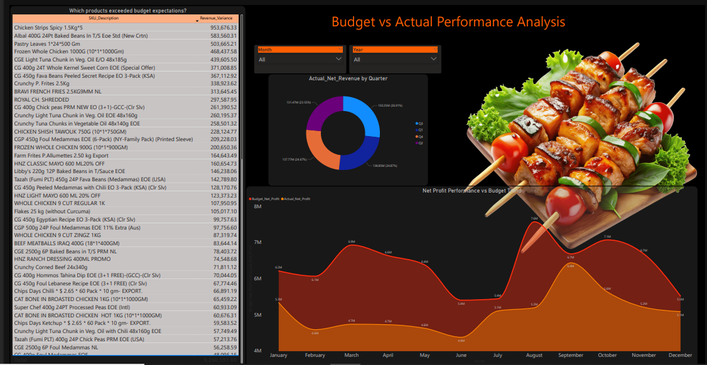
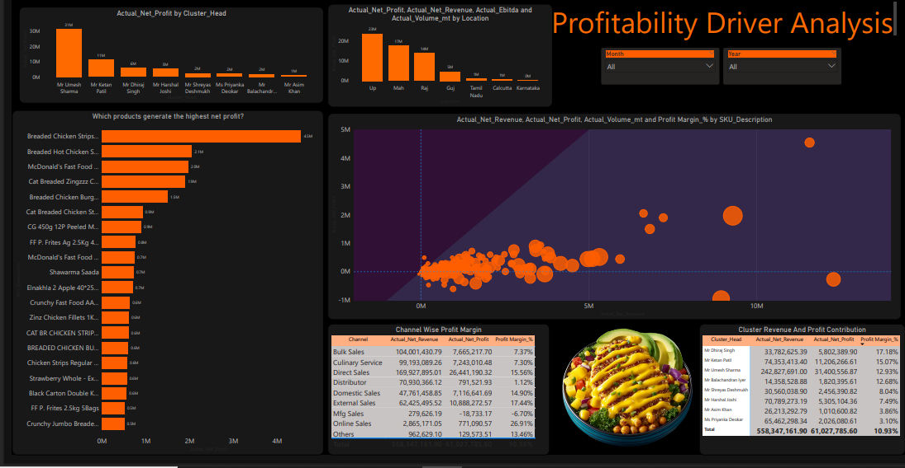
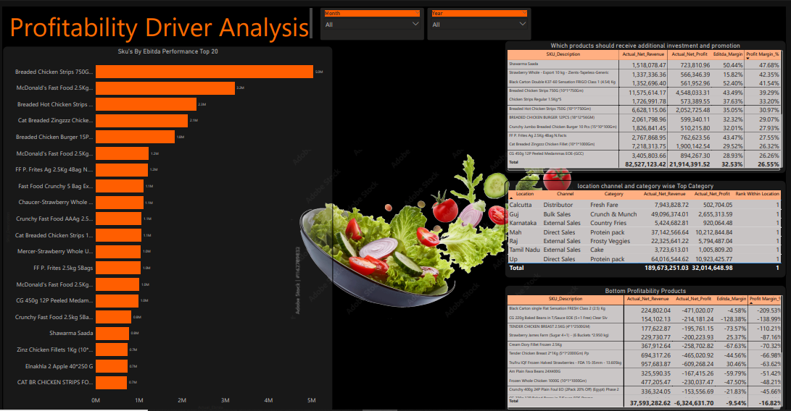
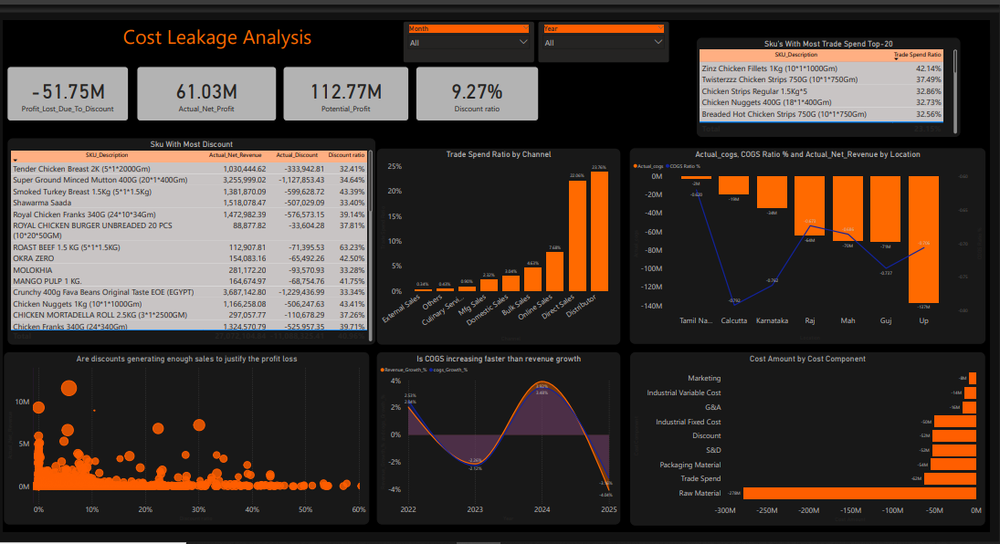

# Enterprise Budget vs Actual Sales & Profitability Analytics Platform

<p align="center">


</p>

---

# 📌 Project Overview

Organizations often struggle with disconnected Actual and Budget data sources, manual reporting processes, inconsistent KPIs, and delayed business decisions.

This project delivers an enterprise-grade **Budget vs Actual Analytics Platform** capable of analyzing:

✅ 500,000+ records
✅ 5 years of historical data
✅ 4,000+ SKUs
✅ Multiple locations and channels
✅ 38 business questions
✅ 4 major business problem statements

The solution transforms raw business data into actionable financial intelligence using Power BI, MySQL, Excel, and advanced DAX calculations.

---

# 🎯 Business Objectives

* Monitor Budget vs Actual performance.
* Identify revenue leakage opportunities.
* Understand profitability drivers.
* Detect cost leakage sources.
* Improve strategic decision making.

---

# 🏗️ Solution Architecture

```text
                               ┌────────────────────┐
                               │  MySQL Actual Data │
                               └─────────┬──────────┘
                                         │
                                         │
                               ┌─────────▼──────────┐
                               │ GitHub Budget Data │
                               └─────────┬──────────┘
                                         │
                                         ▼
                    ┌──────────────────────────────────┐
                    │ Power Query ETL Layer            │
                    │ • Cleaning                       │
                    │ • Validation                     │
                    │ • Standardization                │
                    │ • Data Quality Checks            │
                    └──────────────────────────────────┘
                                         │
                                         ▼
                    ┌──────────────────────────────────┐
                    │ Galaxy Schema Data Model         │
                    │                                  │
                    │ Fact Tables                      │
                    │ • Actual Sales Fact             │
                    │ • Budget Sales Fact             │
                    │                                  │
                    │ Dimension Tables                │
                    │ • Date                          │
                    │ • Product                       │
                    │ • Location                      │
                    │ • Channel                       │
                    │ • Cluster                       │
                    └──────────────────────────────────┘
                                         │
                                         ▼
                    ┌──────────────────────────────────┐
                    │ Advanced DAX Layer              │
                    │ • Variance Analysis             │
                    │ • Growth Analysis               │
                    │ • EBITDA Analysis               │
                    │ • Ranking                       │
                    │ • Cost Analysis                 │
                    │ • What-If Analysis              │
                    │ • PVM Analysis                  │
                    └──────────────────────────────────┘
                                         │
                                         ▼
                    ┌──────────────────────────────────┐
                    │ Power BI Dashboard              │
                    └──────────────────────────────────┘
                                         │
                                         ▼
                    ┌──────────────────────────────────┐
                    │ Power BI Service                │
                    │ • Gateway Refresh              │
                    │ • Scheduled Refresh            │
                    │ • Row Level Security           │
                    └──────────────────────────────────┘
```

---

# 📌 Problem Statement 1

# Data Consolidation & Reporting Automation

## Business Challenge

The organization maintained Actual and Budget data in different systems which caused:

* Reporting delays
* Manual reconciliation
* Duplicate effort
* Inconsistent KPIs
* Data quality issues

## Business Questions Solved

1. How can Actual Sales and Budget data be consolidated?
2. How can data from multiple sources be cleaned and standardized?
3. How can duplicate records be removed?
4. How can Galaxy Schema improve reporting performance?
5. How can manual reporting be reduced?
6. How can Actual and Budget be viewed together?
7. How can data validation be performed?
8. How can reporting delays be reduced?

## Business Impact

✅ Single source of truth
✅ Reduced manual reporting effort
✅ Improved data quality
✅ Faster reporting cycle
✅ Better trust in numbers

---

# 📌 Problem Statement 2

# Budget vs Actual Performance Analysis

## Objective

Determine whether business performance aligns with financial targets.

## Questions Solved

9. Are actual sales meeting budget targets?
10. Which months performed above or below budget?
11. Which products created the largest shortfall?
12. Which products exceeded expectations?
13. Which channels underperformed?
14. Which locations failed targets?
15. What is the variance percentage?
16. Is net profit following the same trend as budget achievement?

---

## 📊 Dashboard Pages

### 📈 Page 1 — Executive Budget Performance Dashboard

Features:

* Revenue KPIs
* Budget KPIs
* Variance KPIs
* Budget Achievement %
* Monthly trends
* Executive Summary



---

### 📈 Page 2 — Variance Drilldown Analysis

Features:

* Product variance analysis
* Channel variance analysis
* Location variance analysis
* Revenue leakage analysis
* Top and Bottom performers



---

# 📌 Problem Statement 3

# Profitability Driver Analysis

## Objective

Identify the products, channels, and locations generating profitability.

## Questions Solved

17. Which products generate the highest net profit?
18. Which products generate high sales but low profit?
19. Which channels generate the highest margins?
20. Which locations contribute the most profit?
21. Which clusters contribute the highest revenue and profit?
22. Which products deliver the highest EBITDA?
23. Are high-volume products highly profitable?
24. Which products deserve additional investment?
25. Which products should be reviewed?
26. Which product-channel-location combination performs best?

---

## 📊 Dashboard Pages

### 📈 Page 3 — Profitability Analysis Dashboard

Features:

* Profitability ranking
* Margin analysis
* Cluster analysis
* Location profitability
* Channel profitability



---

### 📈 Page 4 — Advanced Profitability Analytics Dashboard

Features:

* EBITDA Analysis
* Gross Margin Analysis
* High Volume vs High Profit Analysis
* Investment Opportunity Analysis
* Product Performance Matrix



---

# 📌 Problem Statement 4

# Cost Leakage Analysis

## Objective

Identify controllable costs reducing profitability.

## Questions Solved

27. Which cost component reduces profit the most?
28. How much profit is lost due to discounts?
29. Which products receive the highest discounts?
30. Are discounts generating enough sales to justify profit loss?
31. Which channels require excessive trade spend?
32. Which products have the highest trade spend ratio?
33. Is COGS increasing faster than revenue growth?
34. Which locations have the highest cost burden?
35. Which products have the lowest gross margins?
36. What drives EBITDA decline?
37. Which costs should be reduced first?
38. What profit can be generated through cost reduction?

---

## 📊 Dashboard Pages

### 📈 Page 5 — Cost Leakage Dashboard

Features:

* Discount analysis
* Trade spend analysis
* COGS analysis
* Cost burden analysis
* EBITDA bridge analysis
* What-if scenario analysis



---

# 📊 Project Statistics

| Metric                    | Value                       |
| ------------------------- | --------------------------- |
| Total Records             | 500,000+                    |
| Historical Data           | 5 Years                     |
| Products                  | 4,000+                      |
| Business Questions Solved | 38                          |
| Problem Statements        | 4                           |
| Fact Tables               | 2                           |
| Dashboard Pages           | 5                           |
| Reporting Platforms       | 4                           |
| Deployment                | Power BI Service            |
| Security                  | RLS                         |
| Refresh                   | Gateway + Scheduled Refresh |

---

# 🚀 Advanced Analytics Implemented

* Budget vs Actual Analysis
* Revenue Variance Analysis
* Profitability Analysis
* EBITDA Analysis
* Discount Analysis
* Trade Spend Analysis
* Cost Leakage Analysis
* Growth Analysis
* Dynamic Ranking Analysis
* What-If Analysis
* Price Volume Mix Analysis (PVM)

---

# 🛠️ Technology Stack

| Category      | Technology       |
| ------------- | ---------------- |
| Visualization | Power BI         |
| Database      | MySQL            |
| Validation    | Excel            |
| Data Source   | GitHub           |
| Modeling      | Galaxy Schema    |
| Analytics     | DAX              |
| Deployment    | Power BI Service |
| Security      | RLS              |
| Refresh       | Gateway          |

---

# 🎥 Demo Video

## Project Demonstration

[](YOUR_VIDEO_LINK_HERE)

---

# 👨‍💻 Author

## Dayanand Nimbalkar

Microsoft Certified:

🏅 PL-300 — Power BI Data Analyst Associate
🏅 DP-600 — Fabric Analytics Engineer Associate
🏅 DP-700 — Fabric Data Engineer Associate

---

## ⭐ If you found this project useful, please consider giving it a star.

⭐ Star the repository if you found it valuable for learning Budget vs Actual analytics and financial reporting.
