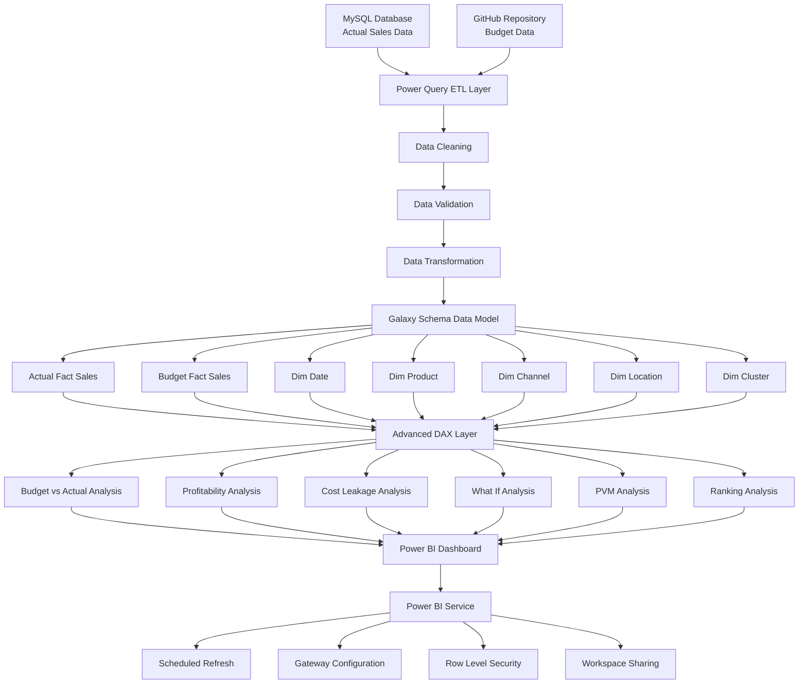

# 🚀 End-to-End QSR Analytics Project with ETL Pipeline using SQL, Excel and Power BI

## 📌 Project Overview

This project demonstrates an end-to-end enterprise analytics solution designed to solve business problems related to sales performance, profitability analysis, and cost leakage monitoring.

The project integrates multiple technologies including:

- MySQL
- Excel
- Power BI
- DAX
- Power Query
- Power BI Service
- Gateway Refresh
- Row Level Security (RLS)

The solution analyzes more than **500,000+ records**, **5 years of historical data**, and solves **38 business questions** across multiple business domains.

---

# 🏗 Architecture

```text
MySQL Actual Sales Data
            │
            │
            ▼
      Power Query ETL
            │
            ▼
GitHub Budget Data Source
            │
            ▼
     Galaxy Schema Model
            │
            ▼
      Advanced DAX Layer
            │
            ▼
      Power BI Dashboard
            │
            ▼
 Power BI Service Deployment
            │
            ├── Scheduled Refresh
            ├── Gateway Configuration
            └── Row Level Security
```
## 🏗️ Solution Architecture


---

# ⚙️ Technology Stack

| Component | Technology |
|-----------|------------|
| Database | MySQL |
| Budget Source | GitHub |
| Validation | Excel |
| ETL | Power Query |
| Analytics | DAX |
| Visualization | Power BI |
| Deployment | Power BI Service |
| Security | RLS |
| Refresh | Gateway |

---

# 📊 Dataset Information

| Metric | Value |
|--------|-------|
| Total Rows | 500,000+ |
| Historical Data | 5 Years |
| Products | 4,000+ |
| Channels | Multiple |
| Locations | Multiple |
| Business Questions Solved | 38 |
| Problem Statements | 4 |

---

# 🎯 Problem Statement 1
# Data Consolidation and Reporting Automation

## Objective

Create a centralized reporting solution by integrating Actual and Budget data from multiple sources.

## Questions Solved

- How can Actual and Budget data be consolidated?
- How can reporting be automated?
- How can data quality be improved?
- How can manual reporting efforts be reduced?
- How can business users access a single source of truth?

## Business Impact

✅ Reduced manual reporting effort  
✅ Improved reporting consistency  
✅ Centralized data model  
✅ Faster business decisions  

---

# 📈 Problem Statement 2
# Budget vs Actual Performance Analysis

## Objective

Identify revenue gaps and measure business performance against targets.

## Questions Solved

✅ Are actual sales meeting budget targets?  
✅ Which months overperformed or underperformed?  
✅ Which products caused budget shortfalls?  
✅ Which products exceeded expectations?  
✅ Which channels are underperforming?  
✅ Which locations are missing targets?  
✅ What is the variance percentage?  
✅ Is profit following the same trend as sales?

## Business Impact

📌 Improved forecasting accuracy  
📌 Faster variance identification  
📌 Better resource allocation  

---

## Dashboard Page 1
### Executive Budget Performance Dashboard


---

## Dashboard Page 2
### Variance Analysis Dashboard


---

# 💰 Problem Statement 3
# Profitability Driver Analysis

## Objective

Understand what truly drives profitability.

## Questions Solved

✅ Highest net profit products  
✅ High sales but low profit products  
✅ Most profitable channels  
✅ Most profitable locations  
✅ Best product-channel combinations  
✅ Highest EBITDA contributors  
✅ Investment worthy products  

## Business Impact

📌 Improved investment decisions  
📌 Better pricing strategies  
📌 Increased profit optimization  

---

## Dashboard Page 3
### Profitability Analysis Dashboard


---

## Dashboard Page 4
### Advanced Profitability Dashboard


---

# 💸 Problem Statement 4
# Cost Leakage Analysis

## Objective

Identify cost drivers reducing profitability.

## Questions Solved

✅ Largest cost leakage component  
✅ Profit lost due to discounts  
✅ Products receiving highest discounts  
✅ Trade spend efficiency analysis  
✅ COGS growth vs Revenue growth  
✅ Location cost burden analysis  
✅ Lowest gross margin products  
✅ EBITDA decline drivers  
✅ Cost reduction opportunities  
✅ What-if scenario analysis

## Business Impact

📌 Reduced operational cost  
📌 Improved pricing strategy  
📌 Increased EBITDA visibility  
📌 Better cost control decisions  

---

## Dashboard Page 5
### Cost Leakage Dashboard


---

# 📊 Advanced Analytics Implemented

- Budget vs Actual Analysis
- Revenue Variance Analysis
- Profitability Analysis
- Cost Leakage Analysis
- EBITDA Bridge Analysis
- Gross Margin Analysis
- Dynamic Ranking
- Top N Analysis
- Trade Spend Analysis
- Discount Analysis
- Growth Analysis
- What-if Analysis
- PVM Analysis

---

# 🚀 Deployment Features

## Power BI Service

✅ Published to Power BI Service  
✅ Scheduled Refresh Enabled  
✅ Gateway Configured  
✅ Demo Row Level Security Implemented  

---

# 📈 Additional Validation

The complete business logic was validated using:

- MySQL Queries
- Excel Validation Models
- Power BI Measures

---

# 🏆 Certifications Applied During Development

- Microsoft PL-300 — Power BI Data Analyst Associate
- Microsoft DP-600 — Fabric Analytics Engineer Associate
- Microsoft DP-700 — Fabric Data Engineer Associate

---

# 👨‍💻 Author

## Dayanand Nimbalkar

Data Analyst | Power BI Developer | Microsoft Fabric Engineer

---

# ⭐ If you found this project useful, consider giving it a star.
